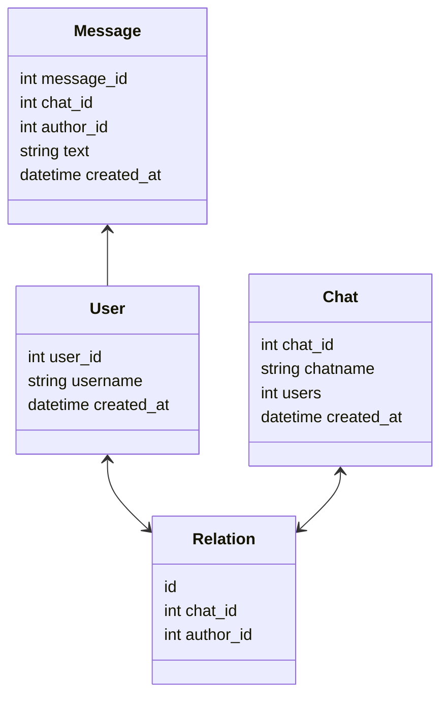

# Сhats-HTTP-API

## Содержание  
0. [Инструкция по запуску приложения](#0)
1. [UML диаграмма](#1)
2. [Документация](#2)

____  

## Инструкция по запуску приложения  
- Подготовка к работе с программой  
    - Устновите **Postman**. Он необходим для тестирования API.  
    - При первом запуске необходимо создать базу данных **PostgreSQL**. Далее необходимо поменять конфигурацию базы данных в соответствии с заданными параметрами. Это можно сделать в файле db_connect.js по следующему пути: "chats-http-api/db_manage/db_connect.js".  
- Запуск сервера  
    - в командной строке необходимо перейти в подкаталог "chats-http-api".  
    - прописать команду **npm start**. Сервер запустится на порту 9000.  
- Обработка запросов и тестирование API в Postman  
    - Создать нового пользователя  
        - POST: http://localhost:9000/users/add  
        - BODY: {"username" : "user_1"}  
    - Создать новый чат между пользователями  
        - POST: http://localhost:9000/chats/add  
        - BODY: {"name" : "chat_1", "users" : ["<USER_ID_1>", "<USER_ID_2>"]}  
    - Отправить сообщение в чат от лица пользователя  
        - POST: http://localhost:9000/messages/add  
        - BODY: {"chat" : "<CHAT_ID>", "author" : "<USER_ID>", "text" : "Hello World!"}  
    - Получить список чатов конкретного пользователя  
        - POST: http://localhost:9000/chats/get  
        - BODY: {"user" : "<USER_ID>"}  
    - Получить список сообщений в конкретном чате  
        - POST: http://localhost:9000/messages/get  
        - BODY: {"chat" : "<CHAT_ID>"}  
____  

## UML диаграмма отношений сущностей базы данных  

____

## Документация
____  
