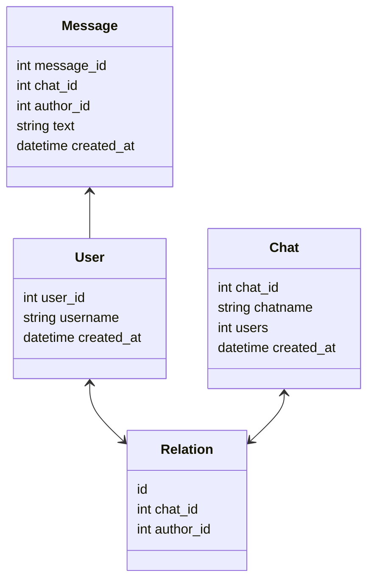

# Сhats-HTTP-API

## Содержание  
0. [Инструкция по запуску приложения](#0)
1. [UML диаграмма](#1)

____  

## Инструкция по запуску приложения
____  

## UML диаграмма отношений сущностей базы данных  

____
