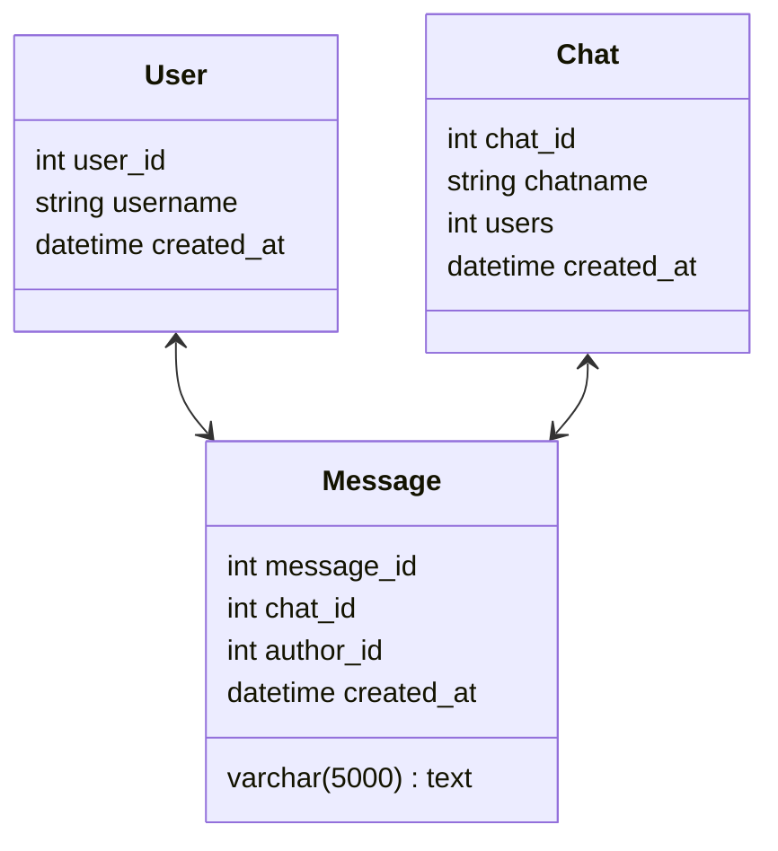

# Сhats-HTTP-API

## Содержание  
0. [Инструкция по запуску приложения](#0)

____  

## Инструкция по запуску приложения
____  

```mermaid

classDiagram  
    class User  
    User : int user_id  
    User : string username  
    User : datetime created_at  
    
    class Chat  
    Chat : int chat_id  
    Chat : string chatname  
    Chat : int users  
    Chat : datetime created_at 
    
    class Message  
    Message : int message_id  
    Message : int chat_id  
    Message : int author_id  
    Message : varchar(5000) text  
    Message : datetime created_at
    
    User <--> Message  
    Chat <--> Message  

```
